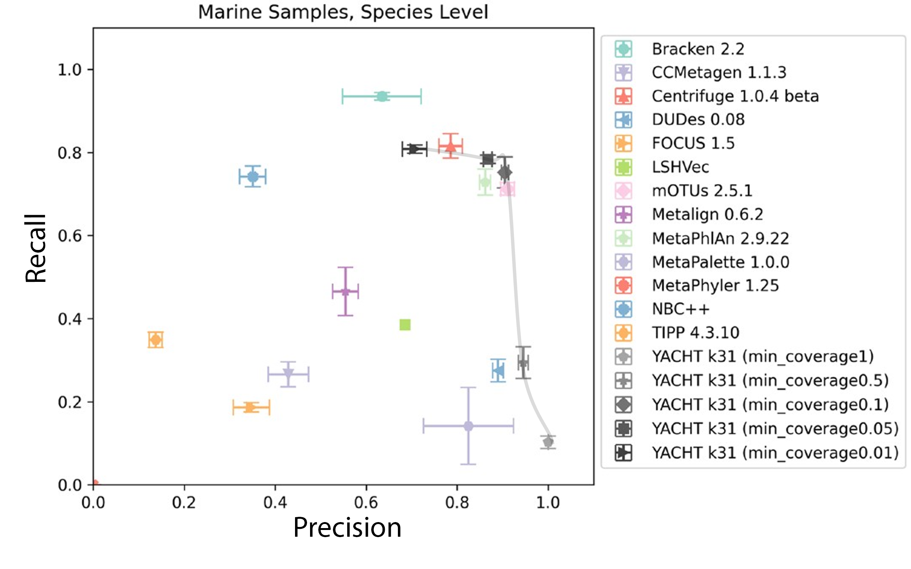

# YACHT Tutorial

The [README](https://github.com/KoslickiLab/YACHT/blob/main/README.md) documentation contains instructions about installation, downloading pre-built databases, making your own databases, and running the tool. This wiki gives a higher-level description of the YACHT approach and also provides some use-cases demonstrating its utility. 

## YACHT: a brief description
YACHT stands for **Y**es/No **A**nswers to **C**ommunity membership via **H**ypothesis **T**esting. It is a mathematically rigorous hypothesis test that determines the presence or absence of each genome from a reference database in a given metagenomic sample under user-defined threshold values. Specifically, the user is required to provide the following values in addition to a reference database and an unprocessed metagenomic sequencing sample: 
1. a false negative rate $a$ which controls the sensitivity of the method. 
1. 2. A value $A$ that indicates the threshold of Average Nucleotide Identity (ANI) above which two organisms will be considered biologically identical. 
2. 3. the coverage $c$ needed for a given microbe's genome to be considered present in the sample. 
 
YACHT then outputs the a file indicating the presence and absence of each of the organisms among those in the 
reference database in the sample. For more detailed explanation of the method, refer to the associated [publication]
(https://doi.org/10.1093/bioinformatics/btae047).

## YACHT workflow


## Working with YACHT

### Installation and database download

You shouldn't need to do this during the workfhop, but for future reference, to install YACHT, you would use the 
following commands
```bash
conda create -n yacht_env -c conda-forge -c bioconda yacht
conda activate yacht_env
```

To download some demo data, you can use the following command
```bash
yacht download demo --outfolder .
```
which will put some demo data in your current directory.

### Running YACHT
There are three different steps to running YACHT:
1. Sketch the sample and reference
2. Train the algorithm
3. Run the algorithm
and optionally later, convert the format to something more standardized.

#### Sketching the sample and reference
To sketch the sample and reference, you would use the following command
```bash
 yacht sketch sample --infile demo/query_data/query_data.fq --kmer 31 --scaled 1000 --outfile sample.sig.zip
```
This command sketches the sample data and saves it to a file called `sample.sig.zip`. You would do the same for the reference data
```bash
yacht sketch ref --infile demo/ref_genomes/ --kmer 31 --scaled 1000 --outfile ref.sig.zip
```

You'll notice that `yacht sketch` is just a convenient wrapper around `sourmash sketch` which we saw in the previous 
section. So all the same commands (like `sourmash sig info`) will work here as well.

#### Training the algorithm
To train the algorithm, you would use the following command
```bash
yacht train --ref_file ref.sig.zip --ksize 31 --num_threads 2 --ani_thresh 0.95 --prefix 'demo_ani_thresh_0.95' 
--outdir ./ --force
```
The most important parameter here is the `--ani_thresh` parameter which sets the threshold for Average Nucleotide 
Identity (ANI) above which two organisms will be considered biologically identical. Since no genome will _exactly_ 
be in your metagenome, this is a parameter that helps you decide how similar a genome needs to be to be considered
identical (i.e. present in your sample). Consider this figure as a rule of thumb:


which is obtained from: https://doi.org/10.1038/s41467-018-07641-9.

So something like an ANI threshold of 0.95 says that two genomes need to be from organisms in the same species to be 
considered identical (i.e. one in your sample and one in your reference). For strain level, you might want to use an 
ANI threshold of 0.99, 0.999, etc. It all depends on your use-case

#### Running the algorithm
Now that you've trained the algorithm, you can run it using the following command
```bash
yacht run --json demo_ani_thresh_0.95_config.json --sample_file sample.sig.zip --significance 0.99 --num_threads 2 
--min_coverage_list 1 0.6 0.2 0.1 --out ./result.xlsx
```
The argument to the `--json` parameter is the file stores info about where the training data is and how you trained 
it. 

The `--significance` parameter is the false negative rate $a$ which controls the sensitivity of the method. 

The `--min_coverage_list` parameter is a list of coverage values needed for a given microbe's genome to be 
considered in the sample. For example, if you have a coverage value of 0.6, then you're saying that you need 60% of 
the genome to in the metagenome for it to be considered present.

We've noticed that a minimum coverage of 0.05 is a balance between sensitivity and specificity. If you make the 
minimum coverage higher, you need to see more of the genome to say it's present, which is more specific but less 
sensitive. And conversely, if you make the minimum coverage lower, you need to see less of the genome to say it's 
present, which is more sensitive but less specific. Here's a figure to help you understand this trade-off:

and


#### Converting the format
If you want to convert the format of the output to something more standardized, you can use the following command
```bash
yacht convert --yacht_output result.xlsx --sheet_name min_coverage0.2 --genome_to_taxid demo/toy_genome_to_taxid.tsv 
--mode cami --sample_name 'MySample' --outfile_prefix cami_result --outdir ./
```
This converts the output to the [CAMI profiling format](https://github.
com/CAMI-challenge/contest_information/blob/master/file_formats/CAMI_TP_specification.mkd). **Note**: this format is for presence _and_ relative 
abundances, even though here we just use it for presence. So abundance-based measurements should not be used on this 
format. 

The `--genome_to_taxid` parameter is a file that maps genome names to their taxonomy IDs. Often you will need to 
construct this file yourself if you are using a custom training database (which we encourage).

Other formats available include: [cami](https://github.
com/CAMI-challenge/contest_information/blob/master/file_formats/CAMI_TP_specification.mkd), [biom]
(https://biom-format.org/), and [graphlan](http://segatalab.cibio.unitn.it/tools/graphlan/).

This format allows for visualizing the taxonomy of the genomes present in your sample. For example, in our demo data,
we have the following:
```
Bacteria
└── Bacillota
    └── Clostridia
        ├── Eubacteriales
        │   ├── Oscillospiraceae
        │   │   ├── Pseudoflavonifractor
        │   │   │   └── Pseudoflavonifractor_sp._MSJ-30
        │   │   └── Acetivibrio
        │   │       └── Acetivibrio_sp._MSJd-27
        │   └── Eubacteriaceae
        │       └── Eubacterium
        │           ├── Eubacterium_sp._MSJ-21
        │           └── Eubacterium_sp._MSJ-13
        └── Lachnospirales
            └── Lachnospiraceae
                └── Blautia
                    └── Blautia_sp._MSJ-19
```


# Please proceed to the [Assembly](Assembly.md) section
