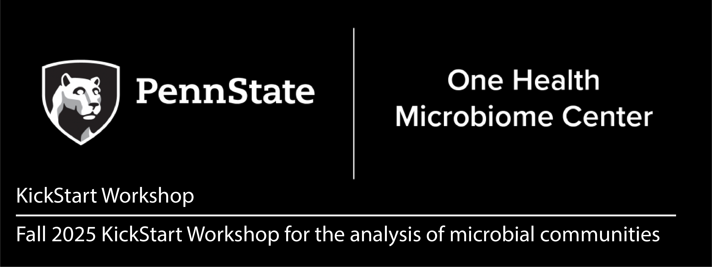

# KickStart-Workshop-2024
Materials for the Fall 2024 PSU One Health Microbiome Center KickStart Workshop.

## Details
**Dates**: August 9 - 15, 2024  (Optional intro to Unix on August 9th, Full workshop August 12 - 15th)  
**Times**: August 9th: 1pm - 4pm; August 12 - 15th: 9am - 3pm  
**Location**: 106 AVBS (in person only)

### Organizers
- Nichole Ginnan (co-chair) (nginnan@psu.edu)  
- Francisco Dini-Andreote (co-chair)	(adreote@psu.edu)
- Emily Davenport	(co-chair) (exd44@psu.edu)
- Liana Burghardt 	(liana.burghardt@psu.edu)
- Sharifa Crandall	(sgcrandall@psu.edu)  
- Estelle Couradeau	(efc5279@psu.edu) 
- Darrell Cockburn	(dwc30@psu.edu)
- Erika Ganda		(ganda@psu.edu)
- Josh Kellogg 		(jjk6146@psu.edu)
- David Koslicki	(dmk333@psu.edu)
- Veronica Roman-Reyna	(vfr5124@psu.edu)

### TAs:
- Iyunoluwa Ademola-Popoola (ija5171@psu.edu)
- Ana Fonseca (afonseca@psu.edu)
- Raúl González-Pech (rag5851@psu.edu)
- Samantha Seibel (sls6550@psu.edu)
- Christine Ta (cjt5751@psu.edu)

## Requirements
A PSU email and access to Penn State’s Roar Collab system is required prior to the workshop. You can do this by going to https://accounts.aci.ics.psu.edu, and entering your information.  For the purposes of this workshop, please list Francisco Dini Andreote (fjd5141) as your account sponsor and put "2024 Microbiome Center Summer Workshop" into the "Research Description" field of the account request form. 

A laptop is also required for the workshop. You can either bring your own or email Nichole Ginnan (nginnan@psu.edu) before _July 28th_ to rent one for free. 

## Schedule
- Day 0 (1pm - 4pm) [OPTIONAL]: [Unix Basics and Intro to R Programming](/Day0-UnixBasics) - Emily Davenport 
- Day 1 (9am - 3pm): Intro + [Basics of Microbiome Analysis - From Planning to Sequencing](/Day1-MicrobiomeAnalysisBasics) - Organizing Committee 
- Day 2 (9am - 3pm): [Amplicon Data Analysis in R](/Day2-AmpliconR) - Sharifa Crandall and Erika Ganda
- Day 3 (9am - 3pm): [Shotgun data analysis (assembly, binning, and profiling)](Day3-Shotgun/README.md) - David Koslicki
- Day 4 (10am - 11pm): [Metabolomics](/Day4-Other) - Josh Kellogg
- Day 4 (11am - 12pm): [Principles of Symbiosis](/Day4-Other) - Liana Burghardt
- Day 4 (1pm - 3pm): Facility tours with Huck Genomics Core (Craig Praul) and Metabolomics Core (Sergei Koshkin)
- Day 4 (3pm - ): Optional social event: Happy Hour or Creamery visit
